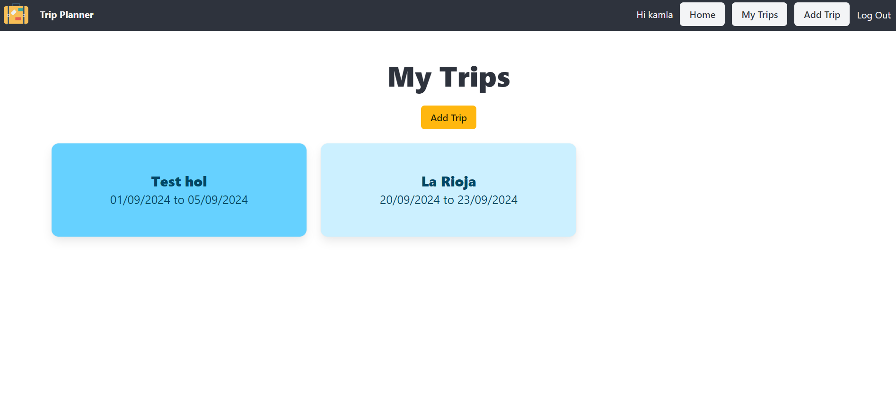

# Project 4 - Trip Planner

## Overview
For the fourth and final project of the General Assembly Software Engineering Course, the requirement was to build a full-stack application with full CRUD functionality using Python/Django/PostgreSQL for the back-end and React for the front-end.

I decided to make an application which enables users to create and plan trips.

## Description of the Application

The homepage has a brief description of the application. The user must sign up / log in to be able to access any other pages on the site.

Once logged in, the user can view all their trips on the 'My Trips' page and from here they have the option of adding a new trip or going to the individual page for a trip.

On the individual trip page, the user can edit details about the trip. They can also invite other users to the trip, leave the trip or delete it. This page also has some useful info about the country they are visiting.

The user can also follow links to search for flights or hotels. Currently, the hotel search only returns hotel details but in the future I would like to add availability and prices. The flight search returns flights and prices but currently the user can only search by city/airport IOTA code so I would also like to improve the flight search feature.

## Deployed Application

[Link to the deployed version here](https://km-trip-planner.netlify.app/) 

## Application Setup

**Front-end and back-end**

The application uses separate repositories for the front-end and the back-end - [link to the back-end repository](https://github.com/kamlasm/trip-planner-backend).

- The front-end is built with React and uses axios requests to talk to the back-end.

- The back-end is built with Django and uses class based views to talk to the PostgreSQL database management system.

- The back-end and front-end use JWT token-based authentication to sign in and out users.

**Models**

In addition to the User model, I initially created only a Trip model. The Trip model had fields for hotels and costs which were arrays of objects. This made it difficult to select and modify the data so I decided to remove these fields from the Trip model and create separate models for Hotel and Cost with a many-to-one relationship to the Trip model.

The User and the Trip have a many-to-many relationship.

**CRUD**

The application has full CRUD fuctionality to enable users to:

- Create a new account, sign in and sign out.
- Add a trip, edit details about the trip and delete the trip. 
- Add, edit and delete hotels and costs related to the trip.
- Add other users to the trip and remove themself from the trip.

**Third-party APIs**

The application uses the following third-party APIs:

- [Rest Countries](https://restcountries.com/#rest-countries) - to get a list of countries for the user to choose from when adding a trip and display info about the country (languages and currency).

- [Exchange Rate API](https://www.exchangerate-api.com/) - to display the current exchange rate of the country of the user's trip.

- [Amadeus](https://developers.amadeus.com/) - for the flight search feature.

- [Hotel Beds](https://developer.hotelbeds.com/) - for the hotel search feature.

**UI/UX**

For the design and layout of the application I used the CSS framework, Bulma.

There is a Navbar with links to all pages for ease of user navigation. 

## Displays from the Application

Home page

My Trips page

Show Trip page

Search Hotels page

## Technologies Used

**Stack**

- Django
- PostgreSQL

**Languages**

- Python
- JavaScript
- HTML
- CSS

## Attributions

- Suitcase icon from [Flaticon](https://www.flaticon.com/free-icons/cdn)

## Future Improvements

- Save the data from the third-party APIs to my database and fetch the data once a day so I don't need to worry about quotas or the API going down.

- Improve the hotel search feature so that you can search by date and see prices and availability for each hotel. Plus options to filter the search.

- Improve the flight search feature so you can search by city/aiport name and not just the IOTA codes. 

- Auto-send an email when inviting someone to the trip, with the option to create an account if they don't already have one.

- Add a flight status feature with live flight tracking from a third-party API.